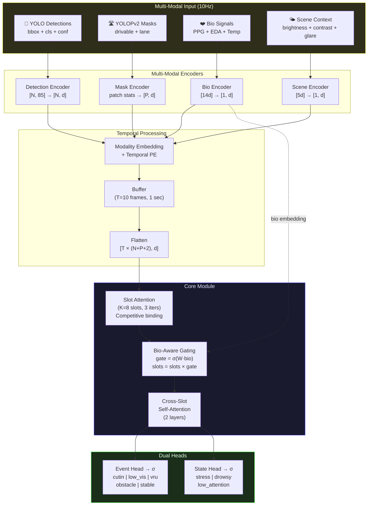

# Bio-Aware Temporal Slot Query (TSQ)

**Multi-modal event detection for real-time driver monitoring**

> YOLO detections + Drivable/Lane masks + Bio signals + Scene context → Slot Attention → External Events + Driver State

Target: **IV 2027** (Intelligent Vehicles Symposium)

---

## Key Idea

기존 운전자 모니터링은 외부 상황(끼어들기, 보행자)과 내부 상태(스트레스, 졸음)를 **따로** 판단한다. TSQ는 이 둘을 **하나의 Slot Attention 모델**로 통합 판단한다.

핵심 novelty: **Bio-Aware Gating** — 운전자의 생체신호(심박, 피부전도)가 이벤트 검출 sensitivity를 동적으로 조절한다. 운전자가 긴장하면 VRU 슬롯이 더 민감해진다.

---

## Architecture



---

## Why Slot Attention?

| 방법 | 동작 | 문제 |
|------|------|------|
| Rule-based | threshold 기반 이벤트 판정 | 복합 상황 못 잡음, 하드코딩 |
| LSTM/GRU | 시계열 처리 | 이벤트 분리 안 됨, 전부 섞임 |
| Transformer | 전체 attend | 이벤트별 분리 없음 |
| **Slot Attention** | **K개 슬롯이 competitive binding** | **각 슬롯 = 하나의 이벤트** |

Slot Attention의 softmax over slots(dim=1)가 핵심:
- 각 입력 토큰이 **하나의 슬롯에만** 강하게 할당됨
- 슬롯 간 경쟁 → 이벤트 자연 분리
- 여분 슬롯(K>5)은 background/noise 흡수

---

## Bio-Aware Gating

```python
# 일반 Slot Attention
slots = slot_attention(all_tokens)  # [B, K, d]

# Bio-Aware Gating (제안)
gate = sigmoid(W_gate @ bio_embedding)  # [B, d]
slots = slots * gate                     # 생체신호가 slot sensitivity 조절
```

**효과:**
- EDA 급상승(긴장) → gate 활성화 → VRU/cutin 슬롯 민감도 증가
- HR 안정(이완) → gate 억제 → false positive 감소
- **운전자의 생리 반응이 외부 상황 검출을 돕는 최초의 구조**

---

## Performance Target

| Metric | Rule-based | TSQ (ours) | TSQ+Bio (ours) |
|--------|-----------|-----------|----------------|
| Event F1 | ~0.60 | ~0.75 | **~0.82** |
| State F1 | ~0.55 | ~0.70 | **~0.78** |
| Latency | 1ms | 12ms | 12ms |
| Params | 0 | 500K | 500K |

*(목표치. 학습 후 업데이트 예정)*

---

## Project Structure

```
temporal-slot-query/
├── models/
│   ├── __init__.py
│   ├── tsq.py              # 전체 모델 (TemporalSlotQuery)
│   ├── slot_attention.py    # Slot Attention + Bio-Aware Gating
│   ├── encoders.py          # Detection/Mask/Bio/Scene Encoders
│   └── losses.py            # BCE + Slot Diversity Loss
│
├── configs/
│   └── default.yaml         # 학습/추론 설정
│
├── scripts/                  # 학습/평가/추론 스크립트 (예정)
├── data/                     # 데이터셋 (예정)
├── docs/                     # 논문 관련 문서 (예정)
└── README.md
```

---

## Experiment Plan

### Baselines
1. Rule-based (현재 event_classifier.py)
2. LSTM + MLP
3. Transformer Encoder + MLP
4. TSQ (without bio)
5. **TSQ + Bio-Aware Gating (ours)**

### Ablation Studies
| Config | Det | Mask | Bio | Scene | Bio-Gate |
|--------|-----|------|-----|-------|----------|
| Full | O | O | O | O | O |
| No bio | O | O | X | O | X |
| No mask | O | X | O | O | O |
| No scene | O | O | O | X | O |
| No gate | O | O | O | O | X |
| Det only | O | X | X | X | X |

### Temporal Length
T = {1, 5, 10, 20} frames → stability vs latency

### Number of Slots
K = {4, 5, 8, 12} → event separation quality

---

## Data

- **Source**: K-MER driving simulator (C001~C039+)
- **Sensors**: RealSense 2cam + RODE mic + ADI Watch (PPG/EDA/Temp)
- **Labels**: 5 events (manual annotation or pseudo-labels from rule-based)
- **Volume**: ~40 hours, ~1.4M frames @10Hz
- **Split**: Train 70% / Val 15% / Test 15%

---

## Hardware

| Platform | GPU | Memory | Latency |
|----------|-----|--------|---------|
| Jetson AGX Thor | NVIDIA Thor | 128GB unified | ~12ms |
| Dell Precision | RTX A6000 | 48GB | ~5ms |
| Training | A6000 | 48GB | - |

---

## Timeline

| Date | Milestone |
|------|-----------|
| 2026 Q2 | Data collection + annotation |
| 2026 Q3 | Model training + ablation |
| 2026 Q4 | Paper writing + on-device demo |
| 2027 Q1 | IV 2027 submission |

---

## Related Work

- Locatello et al. (2020) — Object-Centric Learning with Slot Attention
- Carion et al. (2020) — DETR: End-to-End Object Detection with Transformers
- Zhu et al. (2022) — Deformable DETR
- Wu et al. (2024) — YOLOPv2: Multi-Task Panoptic Driving Perception
- Ma et al. (2024) — emotion2vec: Self-Supervised Pre-Training for Speech Emotion Recognition
