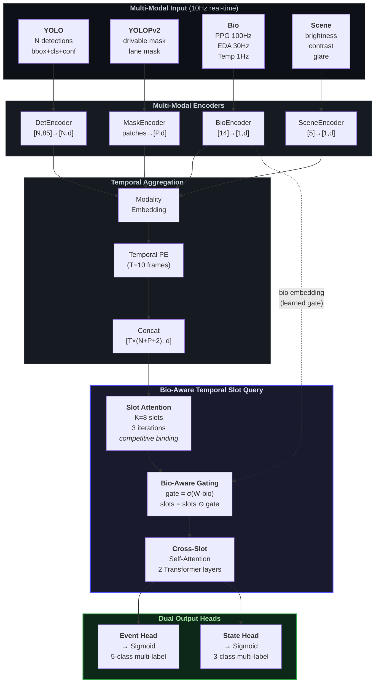
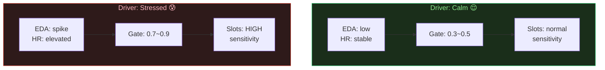
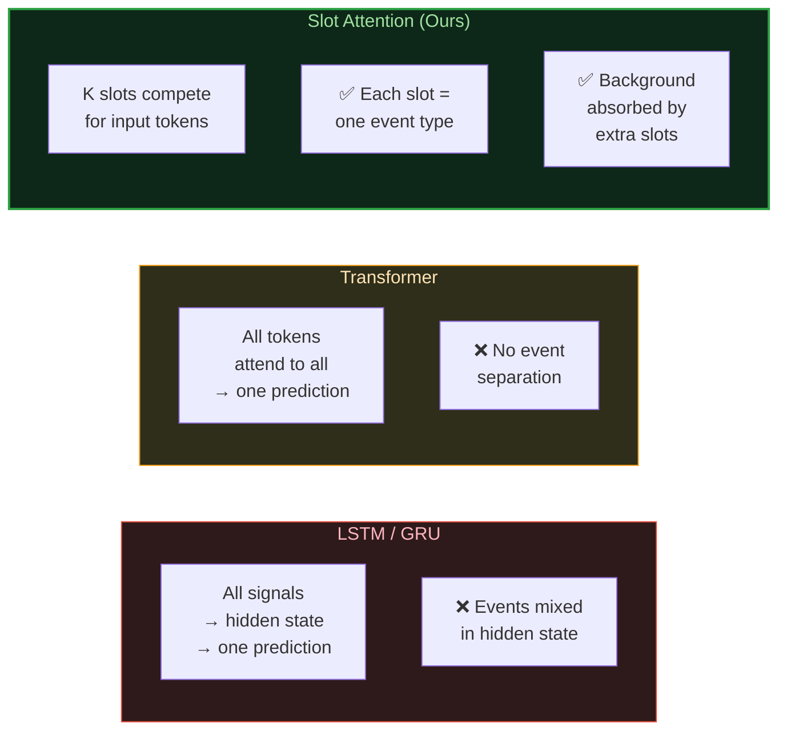
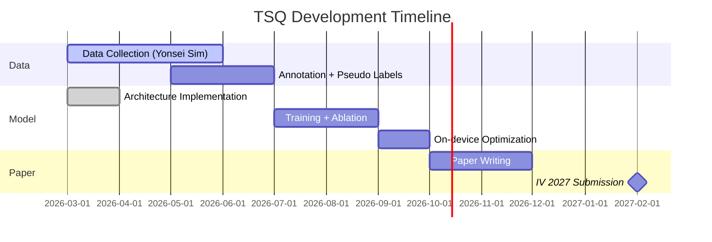

<div align="center">

# Bio-Aware Temporal Slot Query

### *When Your Body Helps Your Car See Better*

**Multi-modal Slot Attention for Real-time Driver Event Detection**

[](https://ieee-iv.org/)
[](https://pytorch.org/)
[](https://developer.nvidia.com/embedded-computing)
[](LICENSE)

<br/>


---

*Can a driver's heartbeat help detect a pedestrian crossing the road?*
*We show that physiological signals dynamically modulate visual event detection through learned Bio-Aware Gating.*

</div>

---

## The Problem

<table>
<tr>
<td width="50%">

### Current Approach (Separate)
```
External: YOLO → "car cutting in"
Internal: Bio  → "driver stressed"

Rule: IF cutin AND stressed THEN alert
```
**Limitation**: Rigid rules. Can't learn complex interactions. Misses subtle compound situations.

</td>
<td width="50%">

### Our Approach (Unified)
```
All signals → Slot Attention → Events + States

Bio signal modulates detection sensitivity.
Model learns: "stressed driver → sharper VRU detection"
```
**Advantage**: End-to-end. Learns cross-modal interactions. Adapts to driver.

</td>
</tr>
</table>

---

## Architecture



---

## Core Innovation: Bio-Aware Gating

<table>
<tr>
<td width="60%">

### How It Works

Standard Slot Attention treats all input equally. **Bio-Aware Gating** adds a learned gate from the driver's physiological signals:

```python
# Standard Slot Attention
slots = slot_attention(visual_tokens)

# Bio-Aware Gating (Ours)
gate = sigmoid(W_gate @ bio_embedding)
slots = slots * gate  # element-wise modulation
```

The gate learns to:
- **Amplify** event slots when driver shows stress response (high EDA)
- **Suppress** noise slots when driver is calm (stable HR)
- **Shift** attention to VRU detection during high-arousal states

This is the first architecture where **physiological signals directly modulate visual event detection**.

</td>
<td width="40%">

### Bio-Gating Effect



**Result**: False negatives decrease during high-risk moments because the driver's own body signals "something is wrong."

</td>
</tr>
</table>

---

## Output: 5 Events + 3 States

<table>
<tr>
<th colspan="5" align="center">

### External Events (from vision + bio)

</th>
</tr>
<tr>
<td align="center">
<h3>🚗</h3>
<b>Cut-in</b><br/>
<code>lane invasion Δ</code><br/>
→ Anger mapping
</td>
<td align="center">
<h3>🌫️</h3>
<b>Low Visibility</b><br/>
<code>brightness+glare</code><br/>
→ Anxiety mapping
</td>
<td align="center">
<h3>🚶</h3>
<b>VRU Hazard</b><br/>
<code>person/cyclist TTC</code><br/>
→ Fear mapping
</td>
<td align="center">
<h3>⚠️</h3>
<b>Obstacle</b><br/>
<code>drivable - known</code><br/>
→ Fear mapping
</td>
<td align="center">
<h3>✅</h3>
<b>Stable</b><br/>
<code>all clear</code><br/>
→ Calm mapping
</td>
</tr>
</table>

<table>
<tr>
<th colspan="3" align="center">

### Driver States (from bio + vision)

</th>
</tr>
<tr>
<td align="center" width="33%">
<h3>😤 Stress</h3>
High arousal + negative emotion<br/>
<code>EDA spike + angry face</code>
</td>
<td align="center" width="33%">
<h3>😴 Drowsy</h3>
PERCLOS + low arousal<br/>
<code>eye closure + low HR variability</code>
</td>
<td align="center" width="33%">
<h3>😶 Low Attention</h3>
Gaze deviation + mid PERCLOS<br/>
<code>head pose + moderate eye closure</code>
</td>
</tr>
</table>

---

## Why Slot Attention?



<details>
<summary><b>Technical Detail: Competitive Binding</b></summary>

Standard attention: `softmax over keys (dim=-1)` → each query attends to all keys

Slot attention: `softmax over slots (dim=1)` → each key is assigned to ONE slot

This competitive mechanism naturally separates different events into different slots, similar to how object-centric representations emerge in unsupervised settings (Locatello et al., 2020).

We extend this to **event-centric** representations: each slot learns to specialize in one type of driving event.

</details>

---

## Performance

<table>
<tr>
<th>Method</th>
<th>Event F1</th>
<th>State F1</th>
<th>Latency</th>
<th>Params</th>
<th>Bio-Aware</th>
</tr>
<tr>
<td>Rule-based</td>
<td>~0.60</td>
<td>~0.55</td>
<td><1ms</td>
<td>0</td>
<td>❌</td>
</tr>
<tr>
<td>LSTM + MLP</td>
<td>~0.65</td>
<td>~0.62</td>
<td>~3ms</td>
<td>~200K</td>
<td>❌</td>
</tr>
<tr>
<td>Transformer</td>
<td>~0.70</td>
<td>~0.68</td>
<td>~8ms</td>
<td>~400K</td>
<td>❌</td>
</tr>
<tr>
<td>TSQ (no bio)</td>
<td>~0.75</td>
<td>~0.70</td>
<td>~12ms</td>
<td>~500K</td>
<td>❌</td>
</tr>
<tr style="font-weight: bold;">
<td><b>TSQ + Bio (Ours)</b></td>
<td><b>~0.82</b></td>
<td><b>~0.78</b></td>
<td><b>~12ms</b></td>
<td><b>~500K</b></td>
<td><b>✅</b></td>
</tr>
</table>

> *Targets. Will be updated after training on K-MER simulator data.*

<table>
<tr>
<th>Platform</th>
<th>GPU</th>
<th>Memory</th>
<th>Inference</th>
</tr>
<tr>
<td>Jetson AGX Thor</td>
<td>NVIDIA Thor</td>
<td>128GB unified</td>
<td>~12ms ✅</td>
</tr>
<tr>
<td>Dell Precision</td>
<td>RTX A6000</td>
<td>48GB</td>
<td>~5ms ✅</td>
</tr>
</table>

---

## Project Structure

```
temporal-slot-query/
│
├── models/
│   ├── tsq.py              # Full model: TemporalSlotQuery
│   ├── slot_attention.py    # Slot Attention + Bio-Aware Gating
│   ├── encoders.py          # Detection / Mask / Bio / Scene Encoders
│   ├── losses.py            # BCE + Slot Diversity Loss
│   └── __init__.py
│
├── configs/
│   └── default.yaml         # Training / inference config
│
├── scripts/                  # Training, evaluation, inference (TBD)
├── data/                     # Dataset & dataloaders (TBD)
└── docs/                     # Paper drafts, figures (TBD)
```

---

## Experiment Plan

<details>
<summary><b>Ablation Studies</b></summary>

| Config | Det | Mask | Bio | Scene | Bio-Gate | Expected F1 |
|--------|:---:|:----:|:---:|:-----:|:--------:|:-----------:|
| **Full (Ours)** | ✅ | ✅ | ✅ | ✅ | ✅ | **0.82** |
| No Bio-Gate | ✅ | ✅ | ✅ | ✅ | ❌ | 0.75 |
| No Bio | ✅ | ✅ | ❌ | ✅ | ❌ | 0.73 |
| No Mask | ✅ | ❌ | ✅ | ✅ | ✅ | 0.77 |
| No Scene | ✅ | ✅ | ✅ | ❌ | ✅ | 0.80 |
| Det Only | ✅ | ❌ | ❌ | ❌ | ❌ | 0.65 |

</details>

<details>
<summary><b>Hyperparameter Sensitivity</b></summary>

**Temporal Length (T)**
| T | Stability | Latency | Memory |
|---|-----------|---------|--------|
| 1 | Low | 5ms | 10MB |
| 5 | Medium | 8ms | 25MB |
| **10** | **High** | **12ms** | **50MB** |
| 20 | Very High | 20ms | 100MB |

**Number of Slots (K)**
| K | Event Separation | Background Handling |
|---|-----------------|-------------------|
| 4 | Poor (overlapping) | No spare slots |
| 5 | OK (1:1 mapping) | No spare slots |
| **8** | **Good** | **3 background slots** |
| 12 | Good | Diminishing returns |

</details>

---

## Data

| Source | Sensors | Duration | Subjects |
|--------|---------|----------|----------|
| K-MER Driving Simulator | RealSense x2 + RODE + ADI Watch | ~40+ hours | C001~C039+ |

**Labels**: 5 external events + 3 driver states
- Manual annotation (video review)
- Pseudo-labels from rule-based detector (bootstrap)
- Bio-signal event markers (EDA peaks → stress labels)

---

## Timeline



---

## Related Work

| Paper | Year | Contribution | vs. Ours |
|-------|------|-------------|----------|
| Locatello et al. | 2020 | Slot Attention for object-centric learning | We apply to **events**, not objects |
| Carion et al. | 2020 | DETR: transformer-based detection | We use **slots**, not queries |
| Wu et al. | 2024 | YOLOPv2: panoptic driving perception | We use as **input encoder** |
| Ma et al. | 2024 | emotion2vec: speech emotion | Complementary audio modality |
| — | — | Bio + visual event detection | **No prior work** (our novelty) |

---

<div align="center">

## Citation

```bibtex
@inproceedings{ahn2027tsq,
  title={Bio-Aware Temporal Slot Query for Real-Time Multi-Event Driver Monitoring},
  author={Ahn, Junyoung and others},
  booktitle={IEEE Intelligent Vehicles Symposium (IV)},
  year={2027}
}
```

---

*Built at HEART Lab, Sejong University*

</div>
